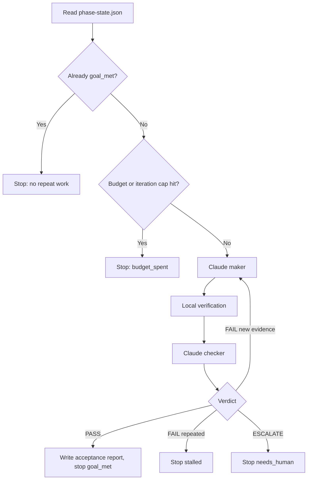

# Desktop Pet Claude Code Loop Design

Date: 2026-06-24

## 1. Background And Goal

This project will use Claude Code CLI to develop a Windows Electron pixel-art desktop pet. The product goal is a lightweight companion app: calm by default, playful in small moments, low-distraction, locally stored, and stable for long-running desktop use.

The development process itself must follow the loop engineering model from `invincible04/awesome-loop-engineering`. The loop is not a one-shot prompt and not a blind cron script. It must discover work, delegate to a maker, verify with a separate checker, persist state, decide what comes next, and stop for an honest reason.

The product roadmap has three phases. The loop may plan all three, but automatic development is initially bounded to Phase 1 only. Phase 2 and Phase 3 require explicit human approval after Phase 1 acceptance.

## 2. Alignment With Awesome Loop Engineering

This design follows these principles from `awesome-loop-engineering`:

- Build the system that prompts the agent; do not hand-prompt every turn.
- Use a loop only when the work has a machine-checkable done condition and repeated trial-and-error.
- The maker never grades its own work. A separate checker decides whether evidence is sufficient.
- State lives on disk, not only in the conversation.
- Every loop needs honest stop conditions: `goal_met`, `budget_spent`, `stalled`, `needs_human`.
- Every unattended loop needs brakes: iteration cap, budget cap, scope limits, repeated-failure detection, watchdog/progress logging, and human escalation.
- Scale to review bandwidth. Each phase ends at a human approval gate.

## 3. Step 0: Should This Be A Loop?

This project is suitable for a loop only if the first target is constrained to a verifiable MVP.

Suitable parts:

- Project scaffolding can be verified by file existence and build commands.
- State machine behavior can be unit tested.
- Settings persistence can be unit tested.
- Explosion particle lifecycle can be unit tested.
- Scope compliance can be checked against a Phase 1 feature list.
- Electron startup can be smoke tested or marked for human GUI verification when automation cannot inspect the desktop.

Unsuitable parts for unattended autonomy:

- Visual taste and companion feeling require human approval.
- Transparent window, tray, right-click menu, and real drag behavior may need manual desktop verification.
- Open-ended Phase 2 and Phase 3 features must not be implemented automatically before Phase 1 is accepted.

Conclusion: use a loop for Phase 1 implementation and evidence gathering, then stop for human acceptance.

## 4. Loop Contract

| Part | Contract |
| --- | --- |
| Objective | Build the Electron desktop pet in phases using Claude Code CLI, with Phase 1 as the first automatic goal. |
| Trigger | Manual command: `.\scripts\run-phase.ps1 -Phase phase1 -MaxIterations 6 -MaxBudgetUsd 8`. Later phases are triggered only after user approval. |
| Discover / Intake | Read the product requirements, `docs/loop-engineering/loop-contract.md`, `docs/loop-engineering/phase-plan.md`, `loop/phase-state.json`, `loop/LOOP_PROGRESS.md`, and the latest verification output. |
| Workspace | Current git repository only. No writes outside the repo. No network services. No user file uploads beyond local processing. No production or destructive system changes. |
| Context | The source requirements file, this design, the loop contract, phase plan, maker prompt, checker prompt, verification scripts, and progress log. |
| Delegation | Claude Code CLI maker implements small changes. Claude Code CLI checker independently reviews evidence, diff, tests, and phase scope. |
| Verification | Local verification script plus checker verdict. Phase 1 also includes a human GUI checklist for desktop-specific behavior. |
| State | `loop/phase-state.json`, `loop/LOOP_PROGRESS.md`, and `loop/reports/phase-1-acceptance.md`. |
| Budget | Per-phase iteration cap, per-maker call budget, per-checker call budget, total phase budget, repeated-failure cap. Initial recommendation: 6 iterations, USD 8 total, same failure twice stops. |
| Escalation | Stop for human if desktop GUI cannot be verified, a high-risk permission is needed, the same failure repeats, phase scope conflicts, or the checker cannot prove the goal. |
| Exit | Only one of: `goal_met`, `budget_spent`, `stalled`, `needs_human`. Even `goal_met` requires human phase approval before Phase 2. |

## 5. Phase Boundaries

### Phase 1: Automatic MVP Goal

The loop may implement only:

- Electron project structure.
- Transparent, frameless desktop pet window.
- Drag movement and position memory.
- Five built-in programmatic pixel placeholder characters.
- Character switching.
- Animation state machine: `idle`, `clicked`, `dragging`, `dragRecover`, `exploding`.
- Right-click menu with an "explode" item.
- Basic Canvas pixel-block explosion effect.
- Simple speech bubble.
- Basic settings persistence.
- Tray show, hide, and quit.

Phase 1 must stop after acceptance report generation.

### Phase 2: Planned Queue, Requires Approval

Phase 2 includes:

- Random event system.
- Hidden mood system.
- Sleeping, peeking at cursor, screen-edge movement, drag dizziness.
- Lightweight todos and reminders.
- Local image-to-pixel-art processing.
- Custom character management.
- Low-resource mode.
- Startup launch setting.

The loop must not implement these in Phase 1, except for small interfaces that keep Phase 1 code extensible.

### Phase 3: Backlog

Phase 3 includes:

- More skins.
- More explosion styles.
- Sound packs.
- Import/export custom characters.
- Hotkeys.
- Plugin-like action system.

These are backlog items only until Phase 2 is accepted.

## 6. Phase Runner Architecture

The runner is a PowerShell script that uses `cmd /c claude ...` so Windows PowerShell execution policy does not block Claude Code's `.ps1` shim.

Planned command:

```powershell
.\scripts\run-phase.ps1 -Phase phase1 -MaxIterations 6 -MaxBudgetUsd 8
```

Runner loop:

1. Read `loop/phase-state.json`.
2. Stop immediately if the phase is already `goal_met`.
3. Stop with `budget_spent` if iteration or budget caps are exceeded.
4. Assemble maker prompt from contract, phase plan, progress, state, and latest failure evidence.
5. Call Claude Code CLI maker.
6. Run `scripts/verify-phase1.ps1`.
7. Assemble checker prompt from requirements, phase plan, diff summary, verification output, and maker result.
8. Call Claude Code CLI checker.
9. Parse checker JSON verdict.
10. Update `phase-state.json` and append `LOOP_PROGRESS.md`.
11. Continue only on fixable `FAIL` with new evidence.
12. Stop on `PASS`, `ESCALATE`, repeated failure, budget cap, or iteration cap.

Mermaid summary:



## 7. State Files And Logs

Planned loop files:

```text
docs/
  loop-engineering/
    source-notes.md
    loop-contract.md
    phase-plan.md

loop/
  phase-state.json
  LOOP_PROGRESS.md
  prompts/
    maker-phase1.md
    checker-phase1.md
    maker-phase2.md
    checker-phase2.md
  reports/
    phase-1-acceptance.md
  schemas/
    phase-result.schema.json

scripts/
  run-phase.ps1
  verify-phase1.ps1
```

`phase-state.json` should store:

```json
{
  "phase": "phase1",
  "status": "not_started",
  "iteration": 0,
  "maxIterations": 6,
  "maxBudgetUsd": 8,
  "spentUsd": 0,
  "lastFailureSignature": null,
  "repeatFailureCount": 0,
  "stopReason": null,
  "requiresHumanApproval": false
}
```

`LOOP_PROGRESS.md` is append-only. Each turn records:

- timestamp
- phase
- iteration
- maker summary
- files changed
- verification command and result
- checker verdict
- next action or stop reason

## 8. Claude Code CLI Strategy

Maker call:

```powershell
cmd /c claude -p "<assembled maker prompt>" `
  --output-format json `
  --allowedTools "Read,Edit,Bash" `
  --permission-mode acceptEdits `
  --max-budget-usd 2 `
  --append-system-prompt "You are the maker. You do not declare done; checker decides."
```

Checker call:

```powershell
cmd /c claude -p "<assembled checker prompt>" `
  --output-format json `
  --allowedTools "Read,Bash" `
  --permission-mode plan `
  --max-budget-usd 1 `
  --append-system-prompt "You are the checker. Default to reject unless evidence proves the phase goal."
```

The runner must capture `total_cost_usd` from both JSON outputs and add it to `spentUsd`.

## 9. Maker Prompt Specification

The Phase 1 maker prompt must require:

- Read loop contract, phase plan, state, and progress before editing.
- Implement the smallest verifiable change.
- Stay inside Phase 1 scope.
- Use TypeScript + React + Electron unless impossible.
- Prefer programmatic pixel placeholders over blocking on art assets.
- Use a unified animation state machine.
- Use `requestAnimationFrame` for visual animation.
- Avoid high-frequency `setInterval` for animation.
- Persist position/settings locally.
- Append progress after every turn.
- Never declare the phase complete.

The maker prompt must forbid:

- Phase 2 or Phase 3 implementation during Phase 1.
- Complex nurture/game systems.
- Complex project-management todos.
- Backend services.
- Uploading user images.
- Test weakening or deletion.
- Bypassing the state machine for animation.
- Destructive user-data behavior.

## 10. Checker Prompt Specification

The Phase 1 checker must output JSON:

```json
{
  "verdict": "PASS",
  "stop_reason": "goal_met",
  "summary": "",
  "evidence": [],
  "blocking_issues": [],
  "phase_scope_violations": [],
  "manual_verification_required": [],
  "next_maker_instruction": ""
}
```

Allowed verdict values:

- `PASS`
- `FAIL`
- `ESCALATE`

Allowed stop reasons:

- `goal_met`
- `stalled`
- `needs_human`
- `null`

Checker rules:

- Default to reject.
- Do not trust maker claims without evidence.
- PASS only if build/tests/static checks pass and Phase 1 evidence is sufficient.
- Mark GUI-only checks as manual verification instead of pretending they passed.
- Fail on Phase 2 scope creep.
- Fail on missing state-machine control for interactions.
- Fail on explosion lifecycle leaks or repeated-trigger hazards.
- Fail on missing persistence evidence.
- Escalate on repeated failure, ambiguous requirements, unsafe permissions, or unverifiable desktop behavior.

## 11. Phase 1 Acceptance Criteria

Automatic checks:

- `package.json` exists with development, build, and test or verification scripts.
- Electron main, preload, and renderer entry points exist.
- Build or typecheck passes.
- State machine has tests for priority and `exploding` exclusivity.
- Explosion engine has tests for particle creation, completion, and cleanup.
- Settings store has tests for defaults, read, and write.
- Scheduler or animation loop does not rely on high-frequency animation `setInterval`.
- No backend service or remote upload path is introduced.
- Phase 2 features are not implemented beyond stable extension points.

Desktop smoke checks:

- App starts.
- Transparent frameless desktop pet window appears.
- Pet can be dragged.
- Position persists after restart.
- Right-click menu opens.
- Explosion triggers and recovers within the intended duration.
- Tray can show, hide, and quit.

If these cannot be automatically inspected, the acceptance report must list them as human checks.

Specification checks:

- Five built-in characters exist as programmatic pixel placeholders or replaceable local assets.
- Character switching exists.
- Click interaction enters `clicked`.
- Drag starts `dragging` and ends `dragRecover`.
- Explosion enters `exploding` and blocks duplicate explosion.
- Bubble system is simple, low-frequency, and locally controlled.
- Timers, animation frames, IPC listeners, mouse listeners, particles, and temporary resources have a cleanup path.

## 12. Stop Conditions And Brakes

Stop conditions:

- `goal_met`: checker returns PASS and acceptance report is written.
- `budget_spent`: phase budget or iteration limit is reached.
- `stalled`: same failure signature appears twice with no new evidence.
- `needs_human`: desktop behavior, permission, ambiguity, or product judgment requires human approval.

Brakes:

- `MaxIterations`.
- `MaxBudgetUsd`.
- Per-call `--max-budget-usd`.
- Repository-only write scope.
- Phase 1 scope boundary.
- Same-failure detection.
- Progress watchdog: every iteration must append `LOOP_PROGRESS.md`.
- Human gate after each phase.

## 13. Risks And Mitigations

| Risk | Mitigation |
| --- | --- |
| Claude implements too much too early | Phase plan and checker fail on Phase 2 scope creep. |
| GUI cannot be verified headlessly | Acceptance report separates automatic evidence from manual checks. |
| PowerShell blocks Claude/NPM shims | Runner uses `cmd /c claude` and `cmd /c npm`. |
| Loop burns budget | Per-call and per-phase budget caps. |
| Same failure repeats | Failure signature and repeat count stop at `stalled`. |
| State or animation logic becomes tangled | Phase 1 requires state-machine tests and module boundaries. |
| Random loops hurt CPU | Phase 1 forbids random event loop; later scheduler must be low frequency. |
| Pixel art assets block progress | Use programmatic placeholders, keep replacement-friendly interfaces. |

## 14. Follow-Up Implementation Entry

After this design is reviewed, the next step is to create an implementation plan. The plan should first generate the loop engineering files and runner, not the Electron app itself.

Recommended implementation order:

1. Create `docs/loop-engineering/source-notes.md`.
2. Create `docs/loop-engineering/loop-contract.md`.
3. Create `docs/loop-engineering/phase-plan.md`.
4. Create `loop/phase-state.json`.
5. Create `loop/LOOP_PROGRESS.md`.
6. Create maker/checker prompt files.
7. Create `scripts/run-phase.ps1`.
8. Create `scripts/verify-phase1.ps1`.
9. Dry-run runner with a no-op checker.
10. Only then allow the runner to call Claude Code maker for Phase 1 implementation.

No Electron code should be generated until the loop scaffolding is reviewed.
